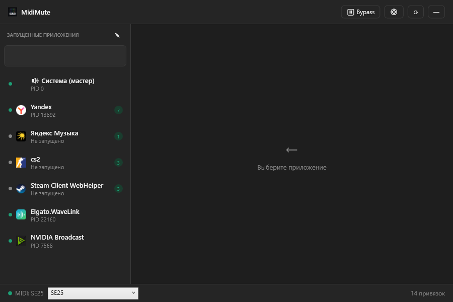
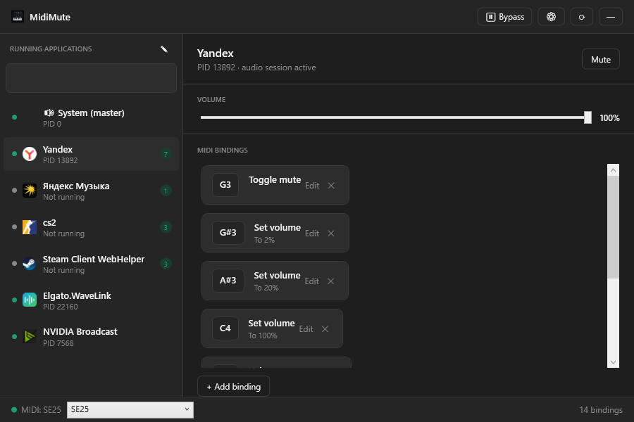

# MidiMute

[](https://github.com/pembrock/MidiMute/actions/workflows/build.yml)
[](https://github.com/pembrock/MidiMute/releases/latest)
[](LICENSE)

Control Windows application volume with a MIDI device.

Website: [pembrock.github.io/MidiMute](https://pembrock.github.io/MidiMute/)

MidiMute is a small Windows utility for binding MIDI keys to per-app audio actions. It is useful when you want quick hardware control over Discord, a browser, music, games, or the master output without opening the Windows volume mixer.





## Features

- Per-app volume control for active Windows audio sessions.
- Master output volume and mute control.
- MIDI bindings for mute, hold mute, volume up/down, set volume, and temporary volume lowering.
- Automatic MIDI reconnect and MIDI device selection.
- Optional MIDI action for restarting a selected Windows audio device.
- Import, export, and backup of settings.
- Hide noisy or unwanted apps from the app list.
- Cached app icons for known applications.
- Dark, light, and system theme modes.
- Russian and English interface languages.
- Optional start with Windows.
- Portable self-contained Windows build.

## Download

The recommended way to use MidiMute is the portable release build:

1. Download the latest `MidiMute-*-win-x64-portable.zip` from [GitHub Releases](https://github.com/pembrock/MidiMute/releases/latest).
2. Extract the archive to any folder.
3. Run `MidiMute.exe`.

Current release: [MidiMute 0.1.0](https://github.com/pembrock/MidiMute/releases/tag/v0.1.0).

No installer is required.

## Usage

1. Connect a MIDI device.
2. Start MidiMute.
3. Select an application from the list.
4. Click `Add binding`.
5. Press a MIDI key and choose the action.

MidiMute stores settings in:

```text
%AppData%\MidiMute\bindings.json
```

Diagnostic logs are written to:

```text
%AppData%\MidiMute\diagnostic.log
```

## Audio Device Restart

This branch includes an experimental MIDI action for restarting a selected Windows audio device. It is intended for cases where a USB audio interface, such as a Focusrite Scarlett Solo, needs the same kind of reset as disabling and enabling it in Device Manager.

Select the device in the audio-device dropdown, then create a MIDI binding with the `Restart audio device` action. On Windows this operation requires elevation, so the action can show a UAC prompt.

For Voicemeeter setups, enable Voicemeeter's own `Auto Restart Audio Engine (All Device)` option. MidiMute only restarts the Windows device; Voicemeeter should handle its audio-engine restart itself.

## Build From Source

Requirements:

- Windows
- .NET SDK 10.0 or newer

Build:

```powershell
dotnet build MidiMute.slnx
```

Publish a portable self-contained build:

```powershell
dotnet publish MidiMute\MidiMute.csproj -c Release -r win-x64 --self-contained true -p:PublishSingleFile=true -p:IncludeNativeLibrariesForSelfExtract=true -p:EnableCompressionInSingleFile=true -p:DebugType=None -p:DebugSymbols=false -o artifacts\MidiMute-portable-win-x64
```

## Status

MidiMute is an early Windows release. The core workflow is usable, but feedback and bug reports are welcome.

## Known Limitations

- Windows only.
- Per-app control depends on Windows audio sessions.
- Some applications may not expose controllable audio sessions until they play sound.
- Some system or protected processes may not be controllable.
- MIDI control depends on the connected device and its MIDI message behavior.

## Contributing

Issues and pull requests are welcome.

Before opening a bug report, please check the known limitations above and include your MidiMute version, Windows version, MIDI device, and steps to reproduce the issue.

For pull requests, please keep changes focused and make sure the project builds:

```powershell
dotnet build MidiMute.slnx
```

## License

MIT
